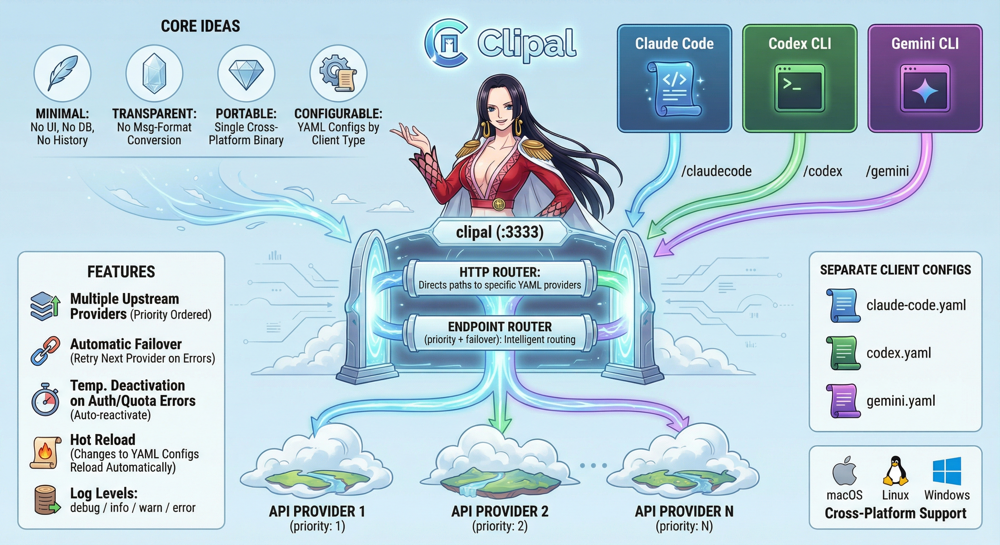

# Clipal



English: [README.md](README.md) | 中文: [README.zh-CN.md](README.zh-CN.md)

Clipal is a local LLM API reverse proxy and management tool.

It consolidates multiple upstream providers behind local endpoints, with automatic failover, hot reload, a built-in Web UI, background service management, and multi-key support. 

It works well not only for Claude Code, Codex CLI, and Gemini CLI, but also for local clients that support a custom Base URL, such as Cherry Studio, Kelivo, Chatbox, and ChatWise.

## What You Can Do With It

- Configure multiple upstream providers per client group with priority-based failover
- Keep separate configs for different client types or protocol styles
- Add, edit, pin, enable, disable, and inspect providers in the Web UI
- Configure multiple API keys per provider and retry within the same provider before moving to the next one
- Manage local status, background services, and updates with `clipal status`, `clipal service`, and `clipal update`
- Run as a single cross-platform binary on macOS, Linux, and Windows

## Web UI


## Which Clients It Fits

Clipal now standardizes client ingress on a single local route:

| Local endpoint | Typical use |
|----------------|-------------|
| `http://127.0.0.1:3333/clipal` | Preferred unified ingress for Claude-, OpenAI-, and Gemini-style requests |
| `http://127.0.0.1:3333/claudecode` | Legacy Claude-compatible alias |
| `http://127.0.0.1:3333/codex` | Legacy OpenAI-compatible alias |
| `http://127.0.0.1:3333/gemini` | Legacy Gemini-compatible alias |

For new setups, point clients at `/clipal` first. The older aliases remain available for compatibility and phased migration. Full compatibility still depends on the client's request format and the upstream provider's compatibility layer. See [docs/en/client-setup.md](docs/en/client-setup.md).

## Quick Start

1. Download the right binary from [Releases](https://github.com/lansespirit/Clipal/releases).
   Current stable release: [`v0.6.2`](https://github.com/lansespirit/Clipal/releases/tag/v0.6.2)
2. Put it on your `PATH` and verify the version:

```bash
chmod +x clipal*
./clipal* --version
```

3. Initialize config files:

```bash
mkdir -p ~/.clipal
cp examples/config.yaml ~/.clipal/config.yaml
cp examples/claude-code.yaml ~/.clipal/claude-code.yaml
cp examples/codex.yaml ~/.clipal/codex.yaml
cp examples/gemini.yaml ~/.clipal/gemini.yaml
```

4. Edit `~/.clipal/*.yaml` and fill in your `api_key` or `api_keys`.
5. Start Clipal:

```bash
clipal
```

6. Verify health and open the management UI:

```bash
curl -fsS http://127.0.0.1:3333/health
clipal status
```

Then open `http://127.0.0.1:3333/` in your browser.

## Example Config Files

- [examples/config.yaml](examples/config.yaml)
- [examples/claude-code.yaml](examples/claude-code.yaml)
- [examples/codex.yaml](examples/codex.yaml)
- [examples/gemini.yaml](examples/gemini.yaml)

## Common Commands

```bash
# Run in foreground
clipal

# Inspect status
clipal status
clipal status --json

# Manage background service
clipal service install
clipal service status
clipal service restart

# Check for updates or update in place
clipal update --check
clipal update
```

## Documentation

- [Getting Started](docs/en/getting-started.md)
- [Client Setup](docs/en/client-setup.md)
- [Config Reference](docs/en/config-reference.md)
- [Web UI Guide](docs/en/web-ui.md)
- [Routing and Failover](docs/en/routing-and-failover.md)
- [Services, Status, and Updates](docs/en/services.md)
- [Troubleshooting](docs/en/troubleshooting.md)
- [macOS](docs/en/macos.md) / [Linux](docs/en/linux.md) / [Windows](docs/en/windows.md)
- [Docs Home](docs/en/README.md)
- [Release Notes](release-notes/)

## Config Directory

Default config directory:

- macOS / Linux: `~/.clipal/`
- Windows: `%USERPROFILE%\\.clipal\\`

Default files:

```text
~/.clipal/
├── config.yaml
├── claude-code.yaml
├── codex.yaml
└── gemini.yaml
```

Field details, examples, and behavior notes live in [docs/en/config-reference.md](docs/en/config-reference.md).

## Security Notes

- The proxy listens on `127.0.0.1:3333` by default
- The Web UI is localhost-only, even if the proxy itself listens on `0.0.0.0` or `::`
- Clipal overrides upstream auth headers from local provider config, so placeholder client-side API keys are usually fine

## License

MIT
